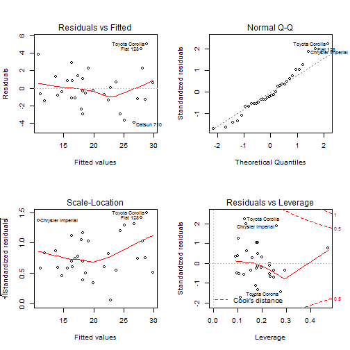

**Miles per Galon Prediction Model**   
**author: Henrique Conte**   
**February 14th, 2016**   

**Executive Summary:**   
This project was developed as the Regression Models' Course Project, and this shiny app is just an implementation of that. This analysis is intended to determine which transmission type has a more efficient MPG and numerically what is that difference.

What we could conclude is that if we analyse only the transmission type, the manual has a way better performance (over **7.24** miles per gallon) over the automatic, but if we consider the other influencing variables of the cars that have these different types, like number of cylinders, hp and weight, we see a not so expressive difference (over **1,81** miles per gallon) but still manual is more efficient.

**Data Analysis:**      
We will start with getting and cleaning the data and doing a brief exploration.

```r
if(!exists("mtcars"))  data("mtcars")
mtcars$am   <- factor(mtcars$am,labels = c("Automatic","Manual"))
mtcars$cyl  <- factor(mtcars$cyl);  mtcars$vs   <- factor(mtcars$vs)
mtcars$gear <- factor(mtcars$gear); mtcars$carb <- factor(mtcars$carb)
attach(mtcars)
```

```r
boxplot(mpg~as.factor(am),main = "Miles per Galon x Transmission Type",
        ylab = "Transmission type", xlab = "Miles per Galon",
        col=c("cadetblue1","coral"),horizontal = TRUE)
        
Automatic <- summary(mtcars[mtcars$am=="Automatic",]$mpg)
Manual <- summary(mtcars[mtcars$am=="Manual",]$mpg)
rbind(Automatic,Manual)
```
 
```
##           Min. 1st Qu. Median  Mean 3rd Qu. Max.
## Automatic 10.4   14.95   17.3 17.15    19.2 24.4
## Manual    15.0   21.00   22.8 24.39    30.4 33.9
```
As shown by this simple box plot and the range of the mpg by type of transmission, it has a high influence over the fuel efficiency and the manual transmission is way more efficient than the automatic.

However, let's now determine how much is this influence when also regarding other variables.

```r
#Creating a linear fit and checking which variables will make the best fit
fit1 <- lm(mpg~.,data=mtcars)
bestfit <- step(fit1,direction = "both")
#Creating a simple correlation from only both variables
fit2 <- lm(mpg~am,data=mtcars)
```

**Results and conclusion:**   
Here are the relations between the variables that most influence the Mileage:

```r
summary(bestfit)$coef
```

```
##                Estimate Std. Error   t value     Pr(>|t|)
## (Intercept) 33.70832390 2.60488618 12.940421 7.733392e-13
## cyl6        -3.03134449 1.40728351 -2.154040 4.068272e-02
## cyl8        -2.16367532 2.28425172 -0.947214 3.522509e-01
## hp          -0.03210943 0.01369257 -2.345025 2.693461e-02
## wt          -2.49682942 0.88558779 -2.819404 9.081408e-03
## amManual     1.80921138 1.39630450  1.295714 2.064597e-01
```
This conclusions assume that all other variables are fixed:   
1. When other influencing variables are considered, the manual transmission is **1.81** miles per gallon better than the automatic   
2. 6 cyls has a **-3.03** mpg and 8 cyls have **-2.16**   
3. Every 1 increase in HP will result in **-0.03** in mpg   
4. Every 1000 lb increase in weight will result in **-2.50** in mpg   

```r
summary(fit2)$coef
```

```
##              Estimate Std. Error   t value     Pr(>|t|)
## (Intercept) 17.147368   1.124603 15.247492 1.133983e-15
## amManual     7.244939   1.764422  4.106127 2.850207e-04
```
5. When only the Transmission type is considered, there is a decrease of **7.24** in mpg of the automatic transmission. (This could also be achieved be decreasing the averages of Manual an Automatic mpgs **```Manual[4] - Automatic[4]```**)

**Appendix:**   
Anova to check between the 3 models:

```r
anova(fit1,fit2,bestfit)
```

```
## Analysis of Variance Table
## 
## Model 1: mpg ~ cyl + disp + hp + drat + wt + qsec + vs + am + gear + carb
## Model 2: mpg ~ am
## Model 3: mpg ~ cyl + hp + wt + am
##   Res.Df    RSS  Df Sum of Sq       F    Pr(>F)    
## 1     15 120.40                                    
## 2     30 720.90 -15   -600.49  4.9874  0.001759 ** 
## 3     26 151.03   4    569.87 17.7489 1.476e-05 ***
## ---
## Signif. codes:  0 '***' 0.001 '**' 0.01 '*' 0.05 '.' 0.1 ' ' 1
```
This results, test the null hypothesys that the fit with all variables is the best (we will consider a 0.05 p threshold. Given the p value of the fit2 (only am) we reject the null, but the bestfit showed a smaller RSS and also a way smaller p rejecting the null hypothesys and confirming the bestfit as the one to be used.

Plotting the Residuals of the best model:

```r
par(mfrow = c(2, 2))
plot(bestfit)
```
 